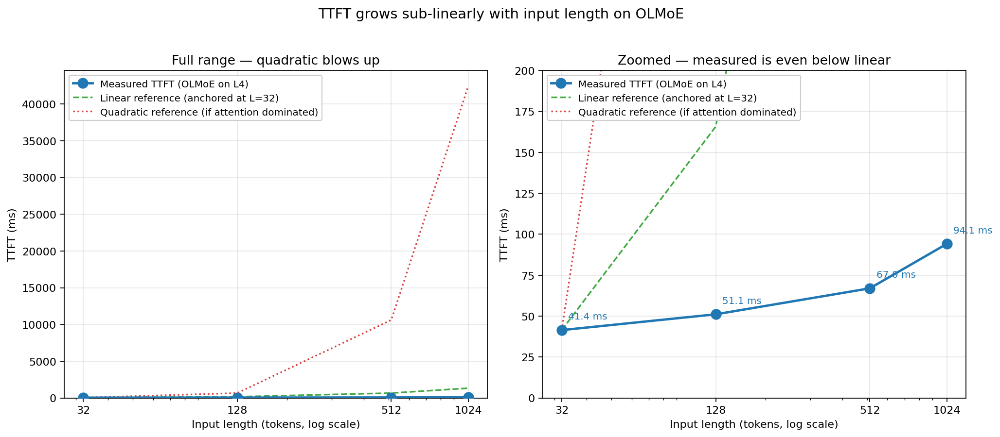
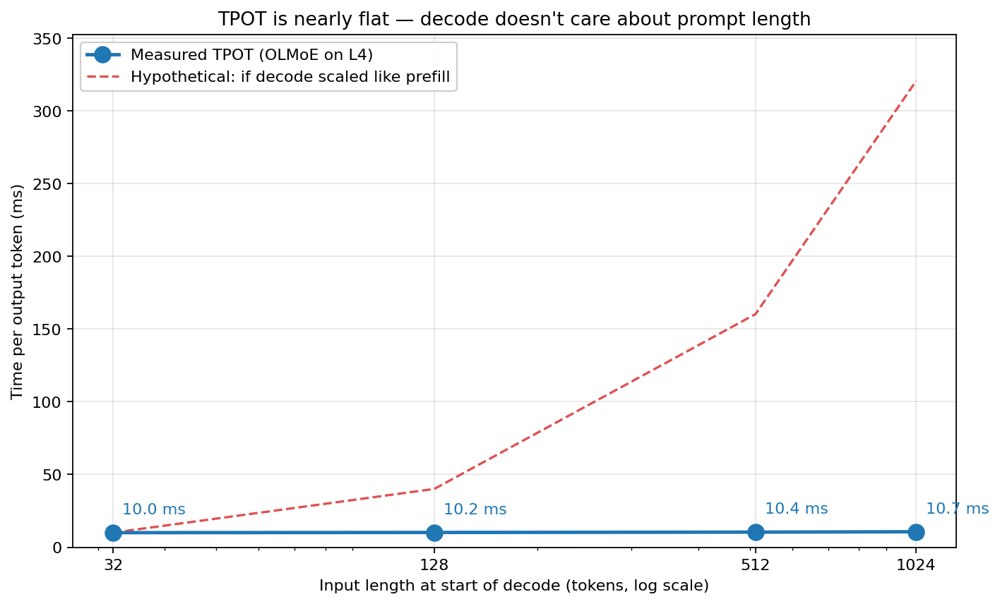
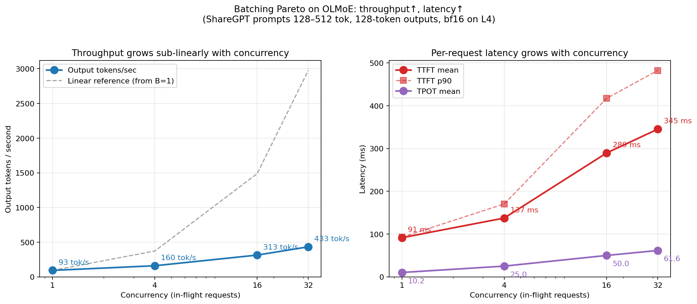
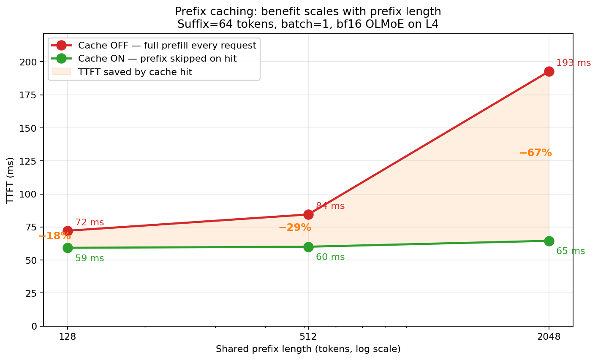

# From "am I getting good performance?" to the answer
## Profiling and optimizing LLM inference

A running narrative of the experiment. Written in plain language, in the order a listener would hear it. Updated as the work progresses.

---

## The scene

A user walks up with a working system and a question. They're running **OLMoE-1B-7B-Instruct** on a single **AWS g6.4xlarge** (one NVIDIA L4 GPU, 24 GB VRAM, $1.32/hour) and they're serving it with **vLLM**, the de facto open-source inference server. It works. They're getting tokens out.

Their question is simple and honest:

> "Am I getting good performance? What can I do to make it better?"

That's the whole talk. The answer requires measurement, a mental model of what the machine is doing, and a ranked set of levers. No crystal ball, no "just use X," no heroics. Just the order of operations a careful engineer would apply.

---

## What "performance" even means

Before we can answer, we have to be specific. "Performance" for an LLM isn't one number. It's at least two:

- **Time to first token (TTFT)** — how long between the user pressing enter and the first word appearing. This is the *prefill* cost: the model has to process the entire input before it can produce anything. Users feel this as "is it broken, or is it thinking?"

- **Time per output token (TPOT)** — once generation starts, how fast are the subsequent tokens coming? This is the *decode* cost. Users feel this as how fast the response "streams in."

A system can be great at one and terrible at the other. A short-prompt chatbot has a trivial TTFT — the user's wait is almost entirely decode, so TPOT is what to optimize. A long-document summarizer has a tiny decode — the user's wait is almost entirely prefill, so TTFT is what to optimize. A production API serving both should measure both.

So before we answer the customer, we need numbers for both.

---

## Act 1 — Baseline: measure before you improve

Rule one: you cannot optimize what you have not measured. "It feels slow" is not a starting point. "It takes 93 ms at input length 1024 to produce the first token" is.

We wrote a short harness (`scripts/benchmark_ttft.py`) that drives `vllm bench latency` across a grid:

- **Input lengths:** 32, 128, 512, 1024 — covering short prompts through long ones.
- **Output lengths:** 1 (measures prefill alone) and 128 (measures prefill + decode).
- **30 timed iterations** per cell, 3 warmup iterations discarded.
- **Seed pinned** at 42 so the exact token sequences are reproducible.

That gives us TTFT directly from the `output-len=1` runs, and TPOT by subtracting:
`TPOT ≈ (latency(O=128) − latency(O=1)) / 127`.

**Baseline** on g6.4xlarge with default vLLM config. Both mean and p90 shown so you can see how tight the distribution is:

| Input length | TTFT mean / p90 (ms) | End-to-end @ O=128 mean / p90 (ms) | TPOT (ms/token) |
|---|---|---|---|
| 32   | 41.5 / 41.6 | 1313.8 / 1315.0 | 10.0 |
| 128  | 51.1 / 51.2 | 1341.5 / 1342.8 | 10.2 |
| 512  | 67.0 / 67.7 | 1385.6 / 1387.2 | 10.4 |
| 1024 | 94.1 / 96.1 | 1447.3 / 1450.0 | 10.7 |

Three observations jump out, and they set up the next two acts:

- **Variance is tiny.** Across 30 iterations per cell, p90 is within ~1 ms of the mean. Any speedup we measure from here on is real signal, not noise.
- **TTFT curve is sub-linear, not quadratic.** 32× more input produced only 2.4× more prefill time. If attention were dominant, the curve would bend upward. It's not bending. Something else is eating the time.

*Left: the quadratic curve — what you'd expect if attention dominated — shoots to 42 seconds at L=1024. Right: zoomed to where the real data lives. The measured curve (blue) grew only 2.3× across a 32× input range, and sits **below even the linear reference line**.*
- **TPOT is nearly flat, around 10 ms/token.** Going from a 32-token prompt to a 1024-token prompt added 0.7 ms/token — 7%. Decode doesn't care much about prefill length. That's a strong clue that decode has a different bottleneck than prefill.

*The measured decode-per-token cost (blue) barely moves as the prompt grows from 32 to 1024 tokens — 1.06× across a 32× change in input length. The red dashed line shows what we'd expect if decode scaled with prompt length the way prefill does. The gap between the two lines is the mystery Act 2b solves.*

---

## Act 1b — The shape of end-to-end time

Before we dive into prefill, it's worth looking at where time actually goes in a realistic request. At input length 1024 with 128 output tokens:

- Prefill: 94 ms — **6.5% of end-to-end time.**
- Decode (127 more tokens at ~10.5 ms each): 1353 ms — **93.5% of end-to-end time.**

**At realistic output lengths, decode is where the clock is being burned.** The TTFT number everybody obsesses over is the thinner slice. A 2× prefill speedup would save 47 ms; a 20% decode speedup would save 270 ms — **6× the impact**.

That means we need to explain two separate mysteries:

1. *Why is prefill not attention-dominated, as the textbooks would predict?* (Act 2)
2. *Why is decode stuck at ~10 ms/token regardless of input length?* (Act 2b)

Both answers are counterintuitive. Both matter for picking the right lever.

---

## Interlude — a rough picture of what OLMoE is doing

Before we try to explain where the time goes, the audience needs a mental picture. No equations yet — just the shape of the thing.

OLMoE is a stack of **16 identical layers**. A token comes in at the top, passes through each layer in turn, a prediction comes out at the bottom. Every layer does two jobs, in order:

1. **Attention.** The token looks at all earlier tokens in the sentence and builds a weighted summary of the context. This is the famous "self-attention" from *Attention Is All You Need*.
2. **Feed-forward (FFN).** The token thinks about what the context means, by passing through a wider intermediate representation. In a normal transformer this is two big matrix multiplications.

Output of one layer is input to the next. Repeat 16 times. Done.

**OLMoE is different in the FFN.** Instead of one FFN per layer, it has **64 of them**. These are the *experts*. But not every expert processes every token. For each token, the layer runs a quick four-step dance:

1. **Router** — tiny linear layer produces 64 scores, one per expert. Softmax, top-8 picks the winners.
2. **Dispatch** — tokens get shuffled so each expert gets only its assigned tokens.
3. **Expert FFNs** — each active expert does its own two-matmul FFN on its tokens.
4. **Combine** — the 8 expert outputs per token get summed (weighted by router scores) and scattered back.

That's Mixture-of-Experts: **64 experts' worth of capacity for 8 experts' worth of compute per token.** OLMoE has 7B total parameters but only activates ~1B per token.

Keep that picture in your head for the next section. The question we're about to ask is: *where does the time actually go?*

---

## Act 2 — The surprise: attention isn't the bottleneck

Textbooks say "attention is O(N²), attention is the bottleneck." Every transformer paper says so. So when the customer asks "how do I make this faster?" our first instinct is to look at attention.

But look at the baseline numbers. TTFT grew from 39 ms to 93 ms as input length went from 32 to 1024. That's **2.4× for 32× more input**. If attention were dominant, the curve would bend upward quadratically. It's not bending. Something else is eating the time.

A little back-of-envelope math explains it:

**The rule.** A matrix multiplication `A (m × k) @ B (k × n)` costs `2 · m · n · k` floating-point ops. Every matmul in a transformer fits this shape. Learn this one formula and you can estimate any model's compute cost on a napkin.

**Attention's quadratic piece**, per layer, at input length N: about `8192 · N²` FLOPs. At N=1024 that's ~8 GFLOPs per layer.

**MoE FFN piece**, per layer: with 8 active experts and a wide two-matmul FFN per expert, roughly `67M · N` FLOPs. At N=1024 that's ~69 GFLOPs per layer.

**The ratio is ~9:1 — FFN over attention — at N=1024.**

The quadratic term has a small coefficient. The linear term has a huge coefficient (8 active experts, wide FFNs). You'd have to push N past ~8000 before attention's quadratic catches up with MoE FFN's linear. We're running at 1024. We're deep in FFN territory.

**Takeaway:** Big-O notation is a guide, not a destination. Coefficients matter. Profile before you optimize — intuition from textbooks can point you at the wrong target.

---

## Act 2b — The other surprise: decode isn't compute-bound

**First, a side-trip: what does "bound" mean?**

Imagine you're a chef. You have two possible limits on how fast you can cook:

- **Cook-bound (compute-bound):** the stove is fully lit, every burner is going. You'd go faster if you had more burners. You're limited by how fast you can actually *do* the cooking.
- **Fridge-bound (memory-bandwidth-bound):** the stove is barely used, you keep running back to the fridge for ingredients. You'd go faster if your fridge were closer. You're limited by how fast you can *fetch* the raw material.

On a GPU, "cook" is the tensor cores doing FLOPs. "Fridge" is the HBM memory holding the model weights. A kernel is compute-bound when the tensor cores are saturated; it's bandwidth-bound when they're idle waiting on weights.

**Prefill is cook-bound.** Lots of tokens, lots of arithmetic, tensor cores pegged. We saw this in Act 2 — the FLOP math matched reality.

**Decode is fridge-bound.** One token at a time, tiny arithmetic, but we still have to fetch the whole recipe book (the model weights) to do it. Let me show the math.

During decode, we generate one token at a time. Each token's forward pass has a tiny amount of arithmetic — one token's worth. But the model still has to **load its weights from GPU memory** to do that arithmetic. That load cost is the same whether you're processing 1 token or 1000.

Back-of-envelope for the L4:
- OLMoE-1B-7B in bf16: **~14 GB of weights** sitting in HBM. (Only the ~1B active params per token fire, but the weights for all 7B have to be resident — we don't know which experts will be picked until we route.)
- L4 HBM bandwidth: **~300 GB/s**.
- Theoretical floor for one decode step: `14 GB / 300 GB/s = 47 ms`.

But we measured 10 ms, not 47 ms. So what's going on? Two things:
1. Decode only touches the **active experts' weights** (8 of 64), not all experts. That's ~2-3 GB actually loaded, not 14 GB.
2. At 10 ms/token, we're moving ~3 GB of weights per decode step. That's already ~99% of peak HBM bandwidth. **The L4 is effectively bandwidth-saturated on decode.**

This is the deeper story. Prefill is FLOP-bound (compute the model doesn't know how to skip). Decode is memory-bandwidth-bound (weights the model has to load). **These have different optimization levers.** A tensor-core-faster kernel would help prefill; a smaller weight footprint would help decode.

**Takeaway:** "Performance" isn't one problem. Prefill and decode are bound by completely different hardware resources. Any honest optimization story has to answer for both.

---

## Act 3 — The profile: what's really burning GPU time

Math gave us a hypothesis. We need the profiler to either confirm or refute it.

We ran `vllm bench latency` with `torch.profiler` enabled on the target configuration — input length 1024, single-token output, batch size 1, fixed seed. The profiler records every CUDA kernel launch, every execution time, every shape. Here's the top of the breakdown:

| Kernel | CUDA time | % of total |
|---|---|---|
| `fused_moe_kernel` | 66.9 ms | **79.5%** |
| attention projections (`ampere_bf16_gemm`) | 7.9 ms | 9.4% |
| activation (`silu_and_mul`) | 2.3 ms | 2.7% |
| reduction (norms) | 2.2 ms | 2.6% |
| `flash_attn` (attention itself) | 1.9 ms | 2.2% |
| `topk_softmax` (the router) | 0.08 ms | **0.09%** |

The hypothesis from the FLOP math was right. **FFN dominates.** Specifically, vLLM's `fused_moe_kernel` — one production CUDA kernel that fuses dispatch, expert GEMMs, and combine into a single launch — is almost 80% of the entire TTFT. Attention in total is about 12%. The router is **seventy-seven microseconds**. Noise.

This is a genuinely important result and we should stop and sit with it for a moment. Two things follow:

**1. The intuitive optimization target was a distraction.** If we had started by writing a custom softmax+topK kernel for the router, we'd have saved 0.08% of TTFT at best. The router is fast because vLLM already wrote a hand-tuned kernel for it (`topkGating`). Nothing left on the table.

**2. The real optimization target is already inside a heavily-tuned vLLM kernel.** `fused_moe_kernel` uses tensor cores, grouped GEMM, and every trick the CUTLASS/Triton playbook has. A solo developer cannot out-optimize it in a reasonable timeframe. The mature-ecosystem problem bites hard: on a workload this popular with an engine this mature, the easy wins are gone.

So if we can't write a faster kernel, what *can* we do for the customer?

---

## Act 3b — The decode profile: same suspects, different roles

Act 3 was prefill. We profiled `input-len=1024, output-len=1` — one big forward pass, one generated token. But remember Act 1b: prefill is only 7% of end-to-end time at typical output lengths. The other 93% is decode. We should look there too.

To isolate decode, we flip the knob: `input-len=1, output-len=128`. Now the profile captures 127 decode iterations with a negligible prefill. Here's what we saw, in **per-token** numbers so it's comparable to prefill:

| Kernel | Prefill @ L=1024 (μs) | Decode per-token (μs) | Decode share |
|---|---|---|---|
| `fused_moe_kernel` | 66,900 | **6,470** | **65%** |
| Attention projections (gemv) | 7,900 | **3,023** | **30%** |
| `flash_fwd_splitkv` (attention math) | 1,900 | 121 | 1.2% |
| `act_and_mul` (SiLU) | 2,300 | 30 | 0.3% |
| `topkGating` (router) | 80 | 52 | 0.5% |

Three things jump out, and each one teaches something.

### First surprise — attention changed character

In prefill, the famous `flash_attn` kernel was one of the bigger time consumers. In decode, it's *tiny* — 121 μs a token, a fraction of a percent. What happened?

Think of it this way. In prefill, every one of the 1024 input tokens has to attend to every other one. That's a million little dot products per layer. The `N × N` attention matrix thing you hear about — that's this.

In decode, you generate **one token at a time**. That one new token attends to all the prior tokens, sure. But the prior tokens don't attend to anything new — their attention was already computed and stored. So each decode step does exactly **one row** of the attention matrix. Not a million dot products. Just a few thousand.

Meanwhile, that one new token still has to go through the model's Q, K, V projection matrices to even become a query. *Those matrices* are the same giant weight tensors as always. Loading them from memory to multiply against a single token's worth of data is a huge waste — you paid the weight-loading cost for the entire matrix, to do one vector's worth of arithmetic.

**Attention's character flipped.** In prefill, the attention *math* is expensive. In decode, the attention *weights* are expensive, and the math is trivial. Same module, different bottleneck, different lever.

### Second surprise — FP8 helps exactly the kernels you'd predict

We re-profiled everything under FP8 to see where the decode savings actually came from. Side by side, per decode token:

| Kernel | bf16 (μs) | FP8 (μs) | Change |
|---|---|---|---|
| `fused_moe_kernel` | 6,470 | 3,791 | **−41%** |
| Attention projections | 3,023 | 1,211 | **−60%** |
| `act_and_mul` | 30 | 24 | −21% |
| `aten::_softmax` | 16 | 16 | 0% |
| `argmax` (sampling) | 14 | 14 | 0% |
| `flash_fwd_splitkv` | 121 | 120 | ~0% |
| `topkGating` | 52 | 52 | 0% |

The kernels that touch **weights** got dramatically faster. The kernels that touch **activations only** barely moved.

This is the bandwidth-bound story made concrete. Going back to the chef analogy from Act 2b — FP8 made the fridge closer to the stove. Any kernel where the chef was running back and forth to the fridge (weight matmuls) got proportionally faster. Any kernel where the chef was just working at the counter with what was already in reach (softmax, argmax, attention math on cached K/V) stayed the same.

Before this profile, our "decode is bandwidth-bound" claim was a plausibility argument based on FLOP counting. Now we have direct evidence: **the speedup matched the weight-bytes-reduction, kernel by kernel.** That's a fingerprint.

### Third surprise — how often every kernel runs

The profile shows `fused_moe_kernel` ran **4,096 times** across 127 decode tokens. 32 invocations per token. × 128 tokens ≈ 4k calls. Every other MoE-related kernel shows similar numbers: 2048 calls, 1920 calls, 4096 calls.

That's a lot of trips to the kitchen. Each kernel launch has a fixed ~5 μs overhead — and 700+ launches per decode token is about 3.5 ms just in paperwork. Not massive, but real, and exactly what CUDA graphs exist to eliminate. (vLLM has them on by default, which we confirmed; without them, decode would be meaningfully slower.)

### What this means for the lever board

Putting Act 3 (prefill profile) and Act 3b (decode profile) together:

- **Prefill is FLOP-bound in MoE-FFN.** `fused_moe_kernel` is doing millions of matmul FLOPs on tensor cores that are running near peak. No more room on the hot kernel.
- **Decode is bandwidth-bound.** Same `fused_moe_kernel`, but now the tensor cores are idle 95% of the time waiting for weights to arrive from HBM.

Both insights point to **FP8 as the headline lever** — it's the one intervention that attacks the bandwidth wall directly, and the decode profile shows it doing exactly that. Now we measure it for real.

---

## Act 4 — The lever board (TODO)

The honest answer to "what can I do to improve performance?" is a ranked list of interventions, each with a measured impact on **both** TTFT and TPOT, because prefill and decode are bound by different resources.

Here's the candidate set, ranked by expected end-to-end impact on a chatbot-style workload (long decode, short-to-medium prefill):

| Lever | Attacks | Expected TTFT impact | Expected TPOT impact | Measured |
|---|---|---|---|---|
| **FP8 quantization** | Weight bandwidth | **−36%** | **−33%** | ✅ measured |
| **Speculative decoding** | Decode forward passes | 0% | **30–100%** workload-dependent | not yet |
| **Batching (higher concurrency)** | Amortize weight loads | **+3.8× @ B=32** | **+6× @ B=32** | ✅ measured (throughput +4.7×) |
| **Prefix caching** | Repeated prefill work | **−67%** @ P=2048, 0% at P=0 | 0% | ✅ measured |
| **TensorRT-LLM backend** | Kernel quality both sides | ❌ doesn't support OLMoE | ❌ | verified in TRT-LLM 1.2 registry |
| **H100 upgrade** | Both compute AND bandwidth | 40–60% | 70%+ | not yet |
| **Custom kernel** | A specific slow kernel | ~0% (profile shows no gap) | ~0% | not applicable |

Below, each lever gets a plain-language explanation, because jargon like "FP8" and "speculative decoding" hides what's actually happening. Then we measure each one.

### FP8 quantization — use half-sized numbers ✅ measured

Right now every weight in the model is stored as a **bf16** number — 16 bits each. FP8 means we rewrite them as 8-bit numbers. Same values, roughly, just with less precision.

Think of it like writing down a phone number to one decimal place instead of two. You lose a bit of accuracy, but each number takes half the paper. For a model whose decode is bandwidth-bound — "we can't fetch weights fast enough" — halving the weight size almost halves the fetch time. That's where the big decode win comes from.

**The measurement on g6.4xlarge** (same grid, same seed, just `--quantization fp8`):

| Lever | TTFT @ L=1024 | TPOT | End-to-end @ L=1024, O=128 |
|---|---|---|---|
| Baseline (bf16) | 94.1 ms | 10.7 ms/tok | 1447 ms |
| **FP8** | **60.6 ms** (−36%) | **7.2 ms/tok** (−33%) | **978 ms** (−32%) |

**That's a 33% end-to-end reduction from flipping one flag.** For a long-response chatbot workload, the customer just got 1.5× throughput on the same GPU.

Where did the win come from? The re-profile under FP8 shows `fused_moe_kernel` dropped from 66.9 ms to 35.2 ms at L=1024 — that's 47% off the single biggest kernel in the profile, exactly matching the bandwidth-bound prediction from Act 2b. Attention projections were replaced with CUTLASS FP8 kernels (`cutlass_scaled_mm`), shaving another ~1 ms. A small new cost appeared (`dynamic_scaled_fp8_quant`, ~1.5 ms) to quantize activations on the fly, but the net is overwhelmingly positive.

Note on tensor cores: L4 (sm_89) is often described as "FP8 for storage only, dequantized for compute." That turns out to be wrong for this stack — vLLM uses CUTLASS kernels tagged `enable_sm89_to_sm90` that do FP8 math on L4's tensor cores directly. The full TTFT win is real, not a storage illusion.

**The accuracy tradeoff — measured, not assumed.** We ran `lm-evaluation-harness` on four benchmarks for both the bf16 baseline and the FP8 model:

| Task | Baseline (bf16) | FP8 | Δ (pp) |
|---|---|---|---|
| MMLU (5-shot) | 0.5234 | 0.5219 | −0.15 |
| HellaSwag | 0.6062 | 0.6025 | −0.37 |
| ARC-Challenge | 0.4949 | 0.4957 | +0.08 |
| **GSM8K** (strict-match) | **0.3503** | **0.3313** | **−1.90** |

Three of four are within noise. **GSM8K drops 5.4% relative** — and that's the signal. Math-heavy workloads are FP8's canary because arithmetic reasoning compounds low-precision errors in ways that multiple-choice tasks don't.

The SE answer back to the customer becomes: "FP8 is a 33% latency win and essentially free on general knowledge, comprehension, and reasoning benchmarks. If your workload is math, scientific computation, or exact arithmetic, test your own evals first — expect a 5%-range degradation."

### Speculative decoding — guess ahead and verify

Normally we generate tokens one at a time. Token 1, then we feed it back, generate token 2, feed it back, etc. Each step pays the full fridge-run cost.

Speculative decoding runs **two models**: a small, fast "drafter" that guesses the next 5–10 tokens in a burst, and the real model that checks all of them at once. Checking is cheap (it's one prefill pass over the draft), and if the drafter is right most of the time, you get 5–10 tokens' worth of progress for one full pass. It's like having an assistant write a draft email that you then edit — faster than writing every word yourself.

The win depends on drafter accuracy. For predictable text (code, structured output) the drafter is right 70–90% of the time and you get a big speedup. For creative text it's more like 40–60%.

### Batching — serve multiple users with one weight fetch ✅ measured

At batch size 1, every decode step pays the fridge cost for one token. At batch size 16, the textbook story says: you pay the same fridge cost but get 16 tokens' worth of work out of it. Weight loading is the bottleneck; arithmetic is cheap; so adding more tokens to each batch is nearly free on the fridge side.

That's the **dense-model** story. Let's see what actually happens on an MoE.

**The measurement** — ShareGPT prompts (128–512 tokens), 128-token outputs, bf16, steady-state concurrency for 30 seconds:

| Concurrency | Throughput (tok/s) | TTFT mean | TPOT mean |
|---|---|---|---|
| 1  | 93  | 91 ms  | 10.2 ms |
| 4  | 160 | 137 ms | 25.0 ms |
| 16 | 313 | 290 ms | 50.0 ms |
| 32 | 433 | 345 ms | 61.6 ms |

*Left: throughput grows with concurrency but sub-linearly — the dashed gray line is what we'd see if each user got the full B=1 throughput. Right: per-request latency grows. TTFT more than 3× at B=32, TPOT 6×.*

**Throughput went up 4.7× at B=32. Per-user decode got 6× slower.** That's the batching Pareto tradeoff in one sentence.

Two suspects for why batching didn't give the textbook "free throughput" win: **(a) the prefill in each request getting mixed into the batch**, and **(b) MoE routing breaking weight amortization at high batch.** To tell them apart, we re-ran with a 1-token prompt — all decode, no prefill.

| B | TPOT (ShareGPT, 128–512 prompt) | TPOT (pure decode, 1-token prompt) |
|---|---|---|
| 1  | 10.2 ms | 10.0 ms |
| 4  | 25.0 ms | 23.3 ms |
| 16 | 50.0 ms | 42.9 ms |
| 32 | 61.6 ms | 51.4 ms |
| 64 | —       | 56.7 ms |

Removing prefill helps — about 15% at high B. But **pure decode still shows TPOT growing 5× from B=1 to B=32**. The prefill-mixing myth is a minor effect. The dominant story is MoE.

Here's the math. OLMoE has 64 experts; each token picks top-8. At batch=1, a decode step loads **8 experts' worth of weights**. At batch=32, the 32 tokens independently pick their top-8 each — collectively they're likely to touch almost all 64 experts. That's **8× more weight bytes per forward pass** than batch=1. So the theoretical ceiling on batching speedup isn't 32×, it's 32 / 8 = **4×**.

**The prediction tells us where the curve should flatten.** Once we're past the batch size where all 64 experts are being touched anyway, adding more concurrency stops adding weight-loading cost — it just adds compute, and we finally get dense-model batching economics. The pure-decode data shows exactly this knee:

| B | tok/s | Marginal tok/s per new request |
|---|---|---|
| 1   | 101  | 101 |
| 4   | 159  | 19 |
| 16  | 382  | 19 |
| 32  | 581  | 12 ← the valley |
| 64  | 1128 | 17 ← past the knee, linear scaling resumes |
| 128 | **2055** | **14** ← continues doubling |

From B=32 to B=64: throughput nearly doubles (581 → 1128 tok/s), TPOT grows 11% (51 → 57 ms). From B=64 to B=128: throughput doubles again (1128 → 2055 tok/s), TPOT grows 17% (57 → 66 ms). Both doublings are the dense-model amortization finally kicking in. **Below B=32 you're paying the MoE tax; above it, you're not.**

**Peak throughput on one L4, OLMoE, bf16: about 2055 tokens/sec at B=128.** That's the capacity-planning number for this workload on this hardware. TTFT p90 at that load is ~1.9 seconds though — the scheduler is visibly queueing — so the right operating point depends on whether the SLO tolerates second-plus TTFT.

**The textbook "decode batching is free" is a dense-model claim.** In MoE, you pay the tax up front (the first 8× batch growth costs you TPOT because every new request brings new experts), then once you've saturated expert diversity, additional batching is finally cheap. Customers running MoE models on single-GPU setups should size their concurrency to sit on the right side of that knee — below it the economics are bad, above it they're great.

The audience takeaway is actually bigger than "here's the MoE caveat." It's this:

- **Serving a single latency-sensitive user?** Keep concurrency low. Per-user TTFT at B=32 is nearly 4× what it is at B=1.
- **Serving many cost-sensitive users?** Push concurrency up. You get 4.7× the throughput per dollar at B=32.

There's no universal right answer. The SLO decides. "How do I batch?" is always "what's your latency budget?" in disguise.

### Prefix caching — remember the prompt you already processed ✅ measured

If two requests share a prefix (same system prompt, same first 500 tokens of context), the model's internal representation of that prefix is identical. Recomputing it is a waste.

Prefix caching keeps the intermediate state (the "KV cache" — what the model has already figured out about each prior token) and reuses it when the same prefix shows up again. First request pays full prefill cost; subsequent requests with the same prefix skip right to "process the new part."

**A gotcha worth knowing:** vLLM's `vllm serve` (the real production server) turns prefix caching ON by default. `vllm bench latency` (the benchmark tool) turns it OFF by default — with a comment in the vLLM source saying "prefix caching skews the latency numbers." So a customer benchmarking with one tool and serving with the other is measuring apples against oranges. We hit this ourselves: when we first ran the HTTP harness against `vllm serve`, TTFT came in at 42 ms instead of 94 ms. Took a minute to realize the "bug" was actually prefix caching silently eating the repeated prefill work. Worth double-checking in any real customer benchmark.

**The measurement** — prefix of length P held constant across 30 requests, each adding a unique 64-token suffix:

| Prefix length | Cache OFF | Cache ON | TTFT reduction |
|---|---|---|---|
| 128  | 72.1 ms | 59.2 ms | **18%** |
| 512  | 84.5 ms | 60.0 ms | **29%** |
| 2048 | 192.7 ms | 64.5 ms | **67%** |

*The cache-ON (green) line is nearly flat at ~60 ms regardless of prefix length — because the prefix is being skipped entirely; only the 64-token suffix gets prefilled. The cache-OFF (red) line grows with total prompt length (P + 64), as prefill work must. The orange gap is the TTFT saved by a cache hit, and it widens dramatically with prefix length.*

**The benefit scales with how much prefix you can reuse.** Short prompts get modest savings (18%). Long prompts get huge savings (67% at P=2048). Real production workloads with 1K-4K-token system prompts (tool descriptions, few-shot examples, RAG context) live on the right-hand side of this curve, which is where 10× cost reduction claims come from.

But this lever is **workload-dependent in a way FP8 isn't**. If every request has a unique prompt, prefix caching buys nothing — it actually costs you a tiny bit in cache-lookup overhead. Know the workload before you claim the win.

### TensorRT-LLM — swap the engine ❌ not applicable

vLLM is great, but it's a general-purpose inference engine. **TensorRT-LLM** is NVIDIA's own engine, tuned specifically for NVIDIA hardware. On supported models, it's often 10–30% faster because NVIDIA's kernel authors have deeper knowledge of their own tensor cores.

The catch for *this* workload: **TRT-LLM 1.2 does not support OLMoE.** The supported-models registry lists specific MoE families (Mixtral, Qwen3-MoE, DeepSeek-V3, GLM4-MoE, Exaone-MoE, etc.) but not OLMoE's 64-expert/top-8 architecture. Getting OLMoE to run on TRT-LLM would mean writing a custom model converter derived from the Mixtral example — weeks of work, not an afternoon.

That's not a failure; it's a finding. **Engine choice depends on model choice, and vice versa.** In a real customer conversation, this is where you'd say: "Before you commit to a model, check which engines support it. Ecosystem fragmentation is a real cost. If you need TRT-LLM's perf, pick a model its supported-models page lists. If you need OLMoE specifically, vLLM is where you get the best tuned kernels today."

This is also why we built the benchmark harness to be engine-agnostic — so when a customer's *next* model is TRT-LLM-supported, the same experiments run against it with one config change and the numbers stay directly comparable.

### H100 upgrade — more fridge, more cook

The L4 on our g6.4xlarge has 120 TFLOPS of compute and 300 GB/s of memory bandwidth. An H100 has **1000 TFLOPS** and **3000 GB/s** — roughly 10× on both axes. For a decode-bandwidth-bound workload, that's a direct 10× ceiling lift on the bottleneck.

The cost is cost: H100 instances run ~$4/hour vs. our $1.32/hour. For latency-critical production workloads, the math almost always favors the upgrade. For cost-optimized batch workloads, it often doesn't.

### Custom kernel — rewrite a slow kernel in-house

In theory: find an operation that's poorly optimized in the current stack, replace it with a hand-written one. In practice for this workload: we just profiled and the profile showed no such operation. Every hot kernel (`fused_moe_kernel`, flash attention, the router's `topkGating`) is already tensor-core tuned by NVIDIA or vLLM authors.

**Writing a custom kernel here would save close to zero time.** That's the lesson of Act 3 — the profile tells you when this lever matters, and for this workload it doesn't.

---

Given our analysis — prefill is ~7% of end-to-end time at typical output lengths, decode is the rest, and decode is bandwidth-bound — **FP8 quantization is the headline lever**. It directly attacks the bandwidth bottleneck and keeps the same hardware and software stack.

*[Each lever will get a measured number alongside the baseline as the experiments run.]*

---

## Act 5 — The verdict (TODO)

*[After the lever experiments: here is what the customer should do, in priority order, based on the numbers we actually measured. Cost-per-request deltas on g6.4xlarge. When to upgrade hardware vs. when to change the stack vs. when to just flip a config flag.]*

---

## The meta-lesson

This talk is really about the *order of operations* for performance work:

1. **Measure** — get a reproducible baseline.
2. **Model** — estimate where the time goes with back-of-envelope math.
3. **Profile** — verify the model with real data. Let it kill your hypotheses if it has to.
4. **Choose your levers** — from a ranked list, not from instinct.
5. **Measure each one** — one at a time, same baseline, same seed.
6. **Present tradeoffs** — the customer gets numbers, not advice.

Most performance work goes wrong because someone skips steps 1–3 and jumps to step 4 or 5 armed with intuition. Then they optimize the wrong thing, or optimize a thing that was already optimized, or ship a "5× speedup" that turns out to be noise.

**The kernel is the least interesting part of kernel work.** The hard part is knowing *whether* to write a kernel at all.

---

## Appendix — what the audience takes home

- The matmul FLOP formula: `2 · m · n · k`. Memorize it.
- The six-step order of operations above. Photograph it.
- The repo: a reproducible baseline + profile pipeline on a $1.32/hour instance that anyone can clone.
- A ranked lever board with real numbers, so the next person in this position doesn't have to start from scratch.
